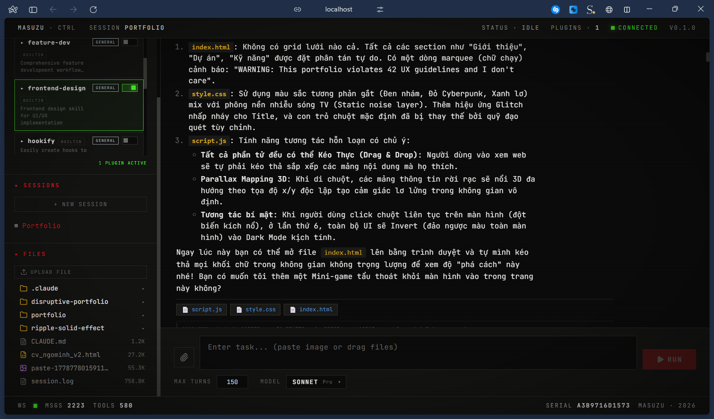

# THE ANTI-PORTFOLIO 💥



A chaotic, brutalist, and highly interactive portfolio built for a Full-Stack AI Engineer. This project deliberately breaks conventional UX rules to create a memorable, experimental, and uniquely engaging web experience.

## Core Concept

The Anti-Portfolio operates on a few rebellious principles:
1. **Nothing is centered.**
2. **Drag everything.** You are not restricted to scrolling; you can pick up, drag, and throw every project card around the screen.
3. **Information is hidden.** You have to click `[+]` to dive deeper into the chaos.
4. **Secret Themes.** Click anywhere 5 times to trigger a global color inversion (Cyberpunk Mode).

## Features

- **Draggable DOM Elements**: Custom JavaScript physics allow users to drag and drop every section. Z-index is automatically managed so the active element is always on top.
- **Dynamic Parallax**: The entire background and all cards shift their perspective based on mouse movement.
- **Brutalist Aesthetics**: Heavy black borders, high contrast cyan/red accents, raw typography (Anton & Space Mono), and custom CSS glitch effects.
- **Interactive "Ping Me"**: A custom copy-to-clipboard button with visual feedback and skewed glitch animations.
- **Responsive Design**: While chaotic on desktop, the portfolio elegantly falls back to a scrollable, accessible vertical layout on mobile devices.

## Tech Stack

- **HTML5**: Semantic structure wrapped in a chaotic presentation.
- **Vanilla CSS3**: No frameworks. 100% custom CSS variables, keyframe animations, pseudo-elements, and hardware-accelerated transforms.
- **Vanilla JavaScript**: Zero dependencies. Custom drag-and-drop logic, event delegation, and DOM manipulation.

## Project Structure

- `index.html`: The main structural file containing the scattered cards.
- `style.css`: The massive stylesheet handling the brutalist design system, custom scrollbars, animations, and media queries.
- `script.js`: The engine behind the drag mechanics, parallax, z-index management, and clipboard logic.
- `images/`: Contains the project screenshots used in the expandable cards.

## Installation & Usage

Since this is a static website, no build step is required.

1. Clone the repository:
   ```bash
   git clone https://github.com/ngominh123asd/my-portfolio.git
   ```
2. Open `index.html` in your favorite modern browser.
3. Start dragging things around!

## UX Warning

*This portfolio violates 42 UX guidelines and I don't care.* 
Enjoy the chaos.

---
*Designed & Built by Masuzu.*
